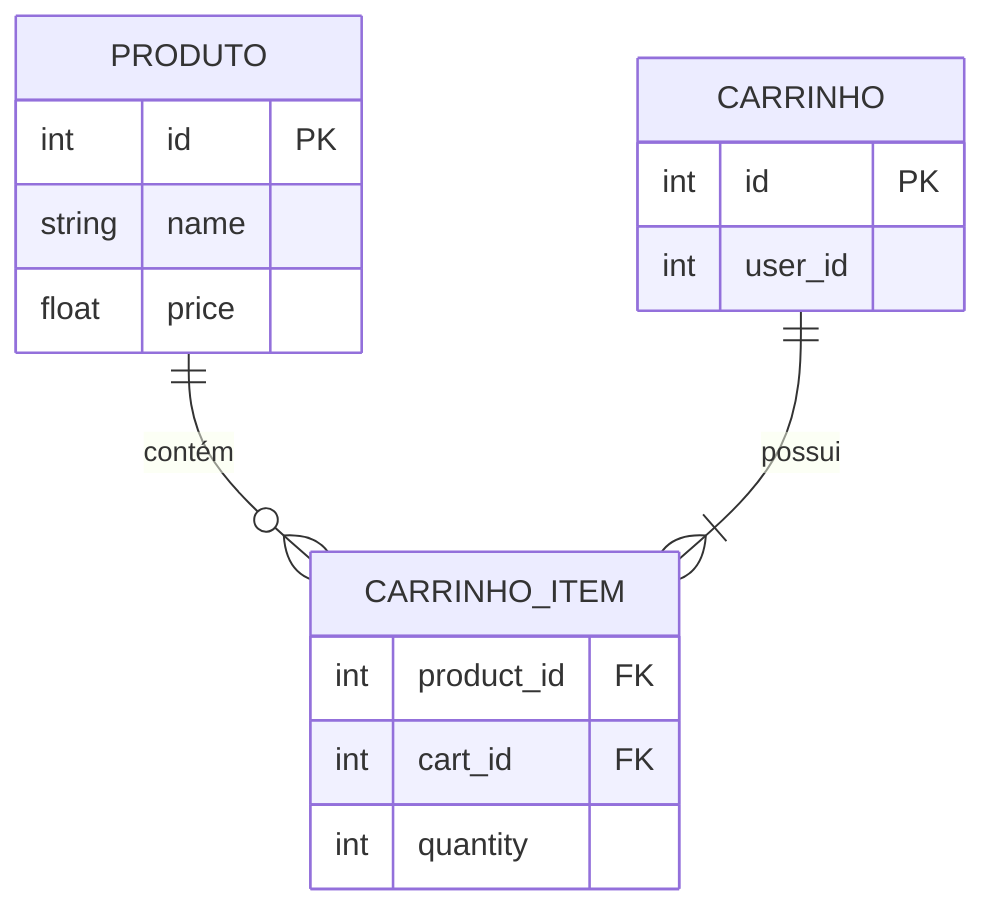

# Diagrama de Entidade-Relacionamento (ER)

Este diagrama ilustra a relação entre as entidades `Produto` e `Carrinho` no sistema TechShop.

```mermaid
erDiagram
    PRODUTO ||--o{ CARRINHO_ITEM : "contém"
    CARRINHO ||--|{ CARRINHO_ITEM : "possui"

    PRODUTO {
        int id PK
        string name
        float price
    }

    CARRINHO {
        int id PK
        int user_id
    }

    CARRINHO_ITEM {
        int product_id FK
        int cart_id FK
        int quantity
    }
```
